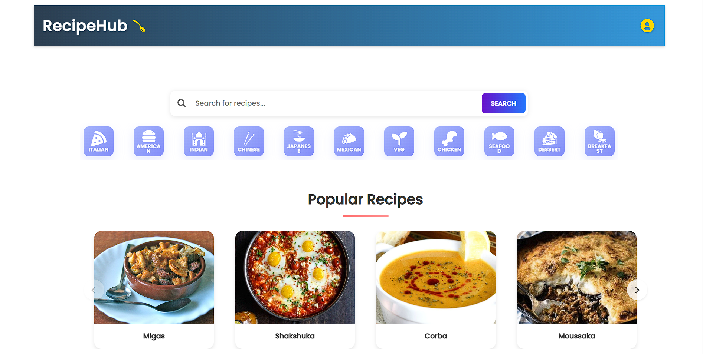
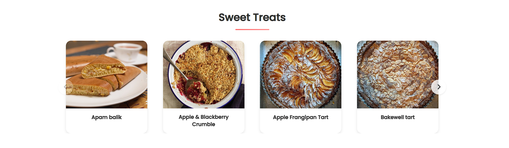
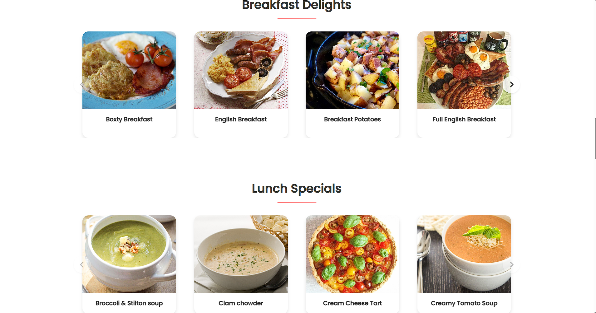
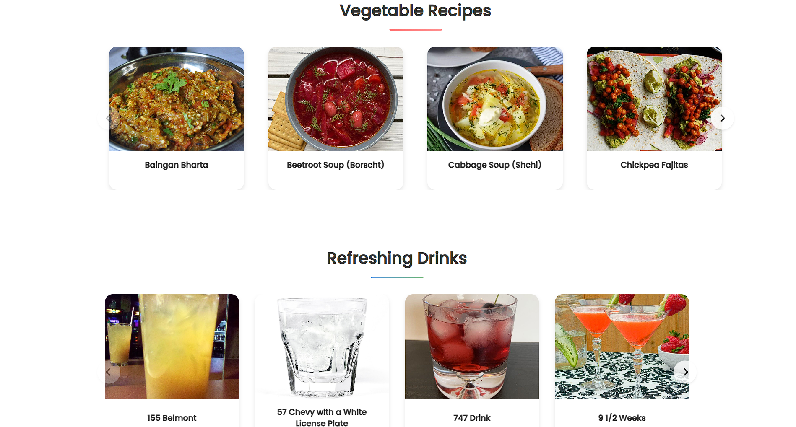
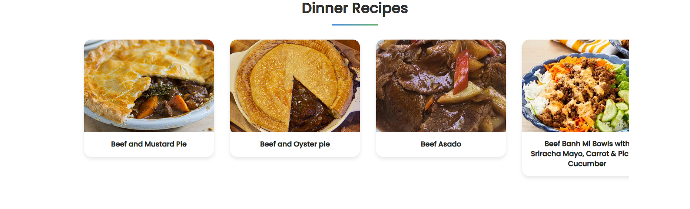
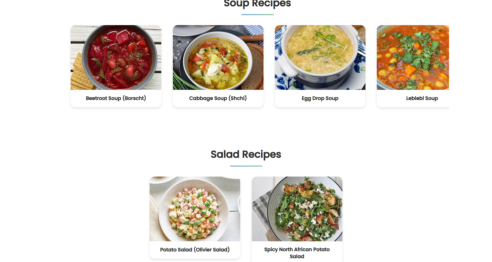
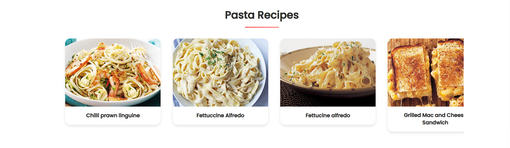

# 🥗 Recipe Hub

Welcome to the **Recipe Finder App** – your one-stop solution for discovering delicious recipes using the ingredients you already have at home! No more confusion or last-minute grocery runs – just smart cooking, made simple and fun.

---

## 🌟 Features

- 🔍 **Search by Ingredient:** Find recipes by entering one or more ingredients.
- 🍽️ **Wide Recipe Variety:** From breakfast to dinner, snacks to desserts.
- 📸 **Visual Interface:** Clean, attractive, and easy-to-navigate UI.
- 💡 **Suggestions:** Get recommended dishes based on what's trending.
- 💬 **Interactive Interface:** Dynamic results, responsive design, and fun to use!

---

## 🖼️ App Preview

|  |  |  |  |
|--------------|--------------|--------------|--------------|

|  |  |  |  |
|--------------|--------------|--------------|--------------|

## 🛠️ Tech Stack

- **Frontend:** HTML, CSS, React js 
- **Backend:**  JavaScript
- **API Integration:** MealDb
- **Responsive Design:** CSS

---

