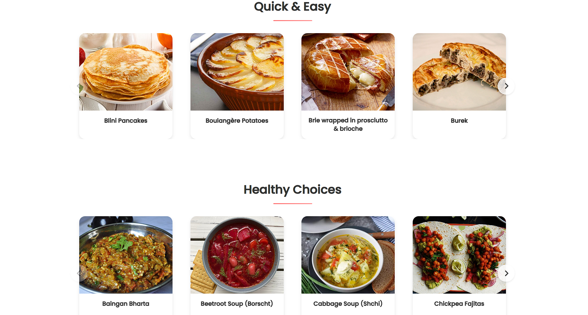

🍽️ Recipe Hub-

The Recipe App is a modern and user-friendly web application that allows users to search, explore, and view cooking recipes using the MealDB API. Designed with simplicity and responsiveness in mind, this app is perfect for food lovers who want to discover new meals with ease.

✨ Project Description-

The Recipe App helps users:
Search for meal recipes by name.
View meal details including image, ingredients, and cooking instructions.
Browse delicious meals from various cuisines.
Enjoy a clean, responsive, and easy-to-navigate interface.
This project was built as a part of my web development learning journey using React.js and API integration.

🛠️ Tech Stack Used-

👨‍💻 Frontend:
HTML – for page structure.
CSS – for styling and layout.
React.js – for building the dynamic user interface.

⚙️ Backend Logic:
JavaScript – used in React for logic, state management, and DOM manipulation.

## 🖼️ App Preview

|  |  |  |  |
|--------------|--------------|--------------|--------------|

|  |  |  |  |
|--------------|--------------|--------------|--------------|

##🔗 API Integration:
MealDB API – used to fetch real-time meal data like names, images, ingredients, and instructions.

📱 Responsive Design:
Achieved using CSS media queries to ensure proper layout on mobile, tablet, and desktop devices.

🚀 Key Features-

✅ Search Functionality – Find meals by typing keywords.
✅ Dynamic Meal Display – Automatically fetches and shows recipes from API.
✅ Recipe Details View – Shows ingredients, instructions, and a meal thumbnail.
✅ Responsive UI – Works perfectly on all screen sizes.
✅ Modern Design – Clean and attractive UI built with React components.

📦 How to Run Locally-

Follow these steps to run the project on your local machine:

Clone the repository

bash

git clone https://github.com/your-username/recipe-app.git
Navigate to the project directory

bash

cd recipe-app
Install the dependencies

bash

npm install
Start the React development server

bash

npm start
Open http://localhost:3000 in your browser to use the app.

🌐 API Used-

API Name: TheMealDB API
Description: Free JSON API for meals and recipes.
Example Endpoint: https://www.themealdb.com/api/json/v1/1/search.php?s=chicken.

---

